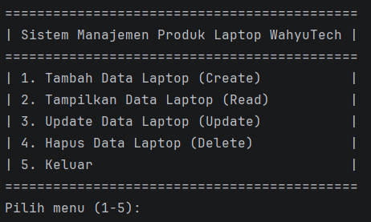
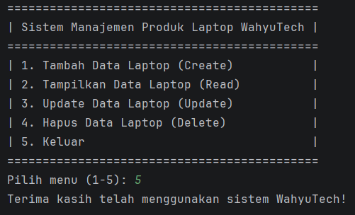

# MANAJEMEN PRODUK LAPTOP WAHYUTECH

**Nama : Zeydan Fazle Mawla**

**NIM : 2409106010**

## Deskripsi Singkat

Program ini adalah aplikasi berbasis terminal untuk mengelola data produk laptop pada toko WahyuTech.

- **Tujuan program**: Membantu pengguna melakukan manajemen data laptop (ID, merk, tipe, harga, stok) secara terstruktur melalui menu interaktif.
- **Fitur utama**: Operasi CRUD (Tambah, Tampilkan, Update, Hapus), validasi ID agar tidak duplikat, pencarian data berdasarkan ID saat update/hapus, serta tampilan tabel data laptop.
- **Teknologi**: Java (OOP), `ArrayList` untuk penyimpanan data sementara di memori, dan `Scanner` untuk input pengguna pada command line.

### Struktur Class

```java
class Laptop {
    String id;
    String merk;
    String tipe;
    double harga;
    int stok;
}

public class WahyuTechApp {
    void main()
}
```

## Demo Program

### Screenshot 1: Tampilan Awal



Berisi tampilan menu yang bisa dilakukan

### Screenshot 2: Create


Proses menambahkan produk laptop

### Screenshot 3: Read


Menampilkan semua produk laptop yang ditambahkan

### Screenshot 4: Update


Mengedit produk yang sudah ditambahkan

### Screenshot 5: Delete


Menghapus produk yang sudah ditambahkan

### Screenshot 6: Keluar



Keluar program

### Screenshot 7: Error Handling


Proses menangani input id yang sudah ada

## Cara Menjalankan

1. Compile program
2. Jalankan aplikasi
3. Ikuti instruksi di layar
