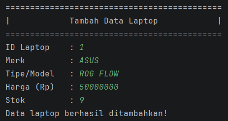
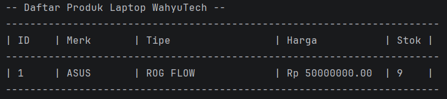
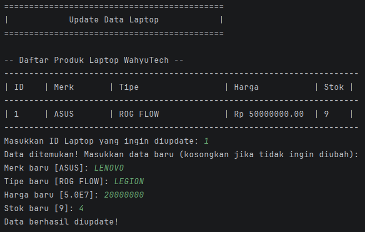
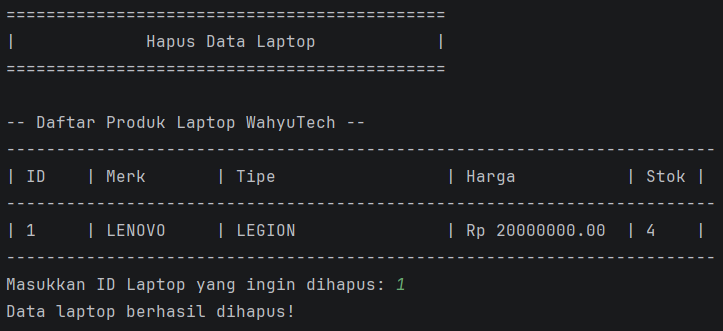
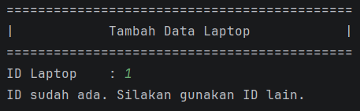

# MANAJEMEN PRODUK LAPTOP WAHYUTECH

**Nama : Zeydan Fazle Mawla**

**NIM : 2409106010**

## Daftar Isi

1. [Deskripsi Singkat](#deskripsi-singkat)
2. [Fitur Baru](#fitur-baru)
3. [Struktur Class](#struktur-class)
4. [Struktur File](#struktur-file)
5. [Demo Program](#demo-program)
6. [Cara Menjalankan](#cara-menjalankan)

## Navigasi Demo Program

1. [Screenshot 1: Tampilan Awal](#screenshot-1-tampilan-awal)
2. [Screenshot 2: Create](#screenshot-2-create)
3. [Screenshot 3: Read](#screenshot-3-read)
4. [Screenshot 4: Update](#screenshot-4-update)
5. [Screenshot 5: Delete](#screenshot-5-delete)
6. [Screenshot 6: Keluar](#screenshot-6-keluar)
7. [Screenshot 7: Error Handling](#screenshot-7-error-handling)

## Deskripsi Singkat

Program ini adalah aplikasi berbasis terminal untuk mengelola data produk laptop pada toko WahyuTech.

- **Tujuan program**: Membantu pengguna melakukan manajemen data laptop (ID, merk, tipe, harga, stok) secara terstruktur melalui menu interaktif.
- **Fitur utama**: Operasi CRUD (Tambah, Tampilkan, Update, Hapus), validasi ID agar tidak duplikat, pencarian data berdasarkan ID saat update/hapus, serta tampilan tabel data laptop.
- **Teknologi**: Java (OOP), `ArrayList` untuk penyimpanan data sementara di memori, dan `Scanner` untuk input pengguna pada command line.

## Fitur Baru

Pada pembaruan versi ini, program telah ditingkatkan untuk mengimplementasikan konsep _Object-Oriented Programming_ (OOP) tingkat lanjut, khususnya **Encapsulation**[cite: 8]. Berikut adalah rincian fitur barunya:

1. **Penerapan Encapsulation dengan 4 Access Modifiers**
   Program kini menerapkan isolasi penanganan data di dalam _class_[cite: 9, 10]. Terdapat penerapan 4 tingkat visibilitas akses yang berbeda:
   - **`private`**: Diterapkan pada atribut `id`, `merk`, dan `tipe` sehingga data tersembunyi sepenuhnya dan tidak bisa diakses langsung dari luar _class_[cite: 189].
   - **`protected`**: Diterapkan pada atribut `harga` agar tetap bisa diakses oleh _subclass_ (yaitu `LaptopGaming`) meskipun berada di _package_ yang berbeda[cite: 143].
   - **`default` (package-private)**: Diterapkan pada atribut `stok`, sehingga data ini memiliki visibilitas terbatas dan hanya bisa diakses di dalam _package_ yang sama (`com.wahyutech.core`)[cite: 144, 145].
   - **`public`**: Diterapkan pada _class_ utama dan metode _Getter/Setter_ agar memiliki izin akses dari mana saja tanpa batasan[cite: 79].

2. **Penggunaan Getter dan Setter beserta Validasi**
   Karena atribut disembunyikan untuk mencegah manipulasi tak terduga, akses untuk membaca dan mengubah data wajib melalui _method Getter_ dan _Setter_[cite: 14, 190]. Terdapat juga implementasi validasi pada metode `setHarga()` untuk memastikan harga yang dimasukkan tidak bernilai negatif (jika `< 0`, otomatis diatur menjadi 0)[cite: 62].

3. **Pemisahan Package (Struktur Folder)**
   Sistem tidak lagi menumpuk di satu tempat. _Class_ dipisah secara terstruktur ke dalam dua _package_ berbeda untuk memisahkan logika utama dengan mesin aplikasi (`com.wahyutech.core` dan `com.wahyutech.app`), sekaligus mendemonstrasikan bagaimana akses antarpaket dikendalikan[cite: 84].

4. **Integrasi Build Tool Maven & Library Eksternal (Poin Plus)**
   Program kini dirancang menggunakan **Maven** (`pom.xml`) untuk mengelola _dependency_. Lewat _build tool_ ini, program memanfaatkan _package/library_ dari luar modul yaitu `Apache Commons Lang 3`. Library tersebut digunakan untuk merapikan input teks pengguna secara otomatis (mengkapitalisasi huruf pertama pada atribut Merk) dengan metode `StringUtils.capitalize()`.

5. **Penerapan Konsep Inheritance (Pewarisan)**
   Adanya pembuatan _class_ `LaptopGaming` yang bertindak sebagai _subclass_ turunan dari _class_ `Laptop` untuk membuktikan fungsionalitas turunan antar-_package_.

## Struktur Class

```java
public class Laptop {
    private String id;
    private String merk;
    private String tipe;
    protected double harga;
    int stok;
}
```

## Struktur File

```bash
POSTTEST_2/
|-- .gitignore
|-- pom.xml
|-- README.md
|-- .idea/
|   |-- .gitignore
|   |-- compiler.xml
|   |-- encodings.xml
|   |-- jarRepositories.xml
|   |-- misc.xml
|   |-- vcs.xml
|   `-- workspace.xml
|-- .mvn/
|-- src/
|   |-- main/
|   |   |-- java/
|   |   |   |-- com/
|   |   |   |   `-- wahyutech/
|   |   |   |       |-- app/
|   |   |   |       |   |-- LaptopGaming.java
|   |   |   |       |   `-- WahyuTechApp.java
|   |   |   |       `-- core/
|   |   |   |           `-- Laptop.java
|   |   |   `-- org/
|   |   |       `-- example/
|   |   |           `-- Main.java
|   |   `-- resources/
|   `-- test/
|       `-- java/
`-- target/
    |-- classes/
    |   |-- com/
    |   |   `-- wahyutech/
    |   |       |-- app/
    |   |       |   |-- LaptopGaming.class
    |   |       |   `-- WahyuTechApp.class
    |   |       `-- core/
    |   |           `-- Laptop.class
    |   `-- org/
    |       `-- example/
    |           `-- Main.class
    |-- generated-sources/
    |   `-- annotations/
    `-- test-classes/
```

## Demo Program

### Screenshot 1: Tampilan Awal


Berisi tampilan menu yang bisa dilakukan

### Screenshot 2: Create



Proses menambahkan produk laptop

### Screenshot 3: Read



Menampilkan semua produk laptop yang ditambahkan

### Screenshot 4: Update



Mengedit produk yang sudah ditambahkan

### Screenshot 5: Delete



Menghapus produk yang sudah ditambahkan

### Screenshot 6: Keluar


Keluar program

### Screenshot 7: Error Handling



Proses menangani input id yang sudah ada

## Cara Menjalankan

1. Compile program
2. Jalankan aplikasi
3. Ikuti instruksi di layar
