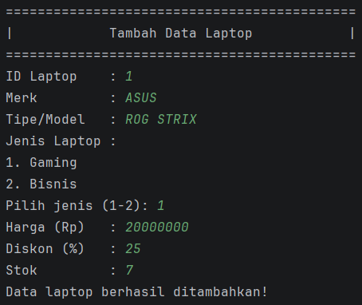
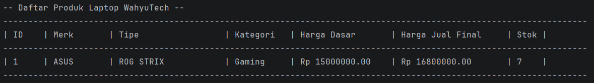
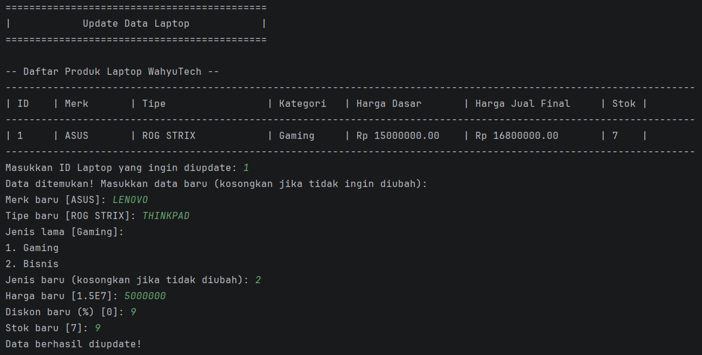
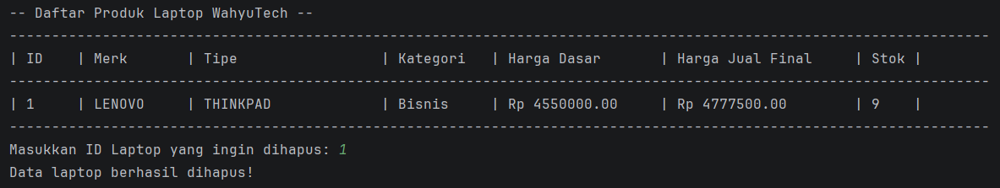

# MANAJEMEN PRODUK LAPTOP WAHYUTECH

**Nama : Zeydan Fazle Mawla**

**NIM : 2409106010**

## Daftar Isi

1. [Deskripsi Singkat](#deskripsi-singkat)
2. [Fitur Baru](#fitur-baru)
3. [Struktur Class](#struktur-class)
4. [Struktur File](#struktur-file)
5. [Demo Program](#demo-program)
6. [Cara Menjalankan](#cara-menjalankan)

## Navigasi Demo Program

1. [Screenshot 1: Tampilan Awal](#screenshot-1-tampilan-awal)
2. [Screenshot 2: Create](#screenshot-2-create)
3. [Screenshot 3: Read](#screenshot-3-read)
4. [Screenshot 4: Update](#screenshot-4-update)
5. [Screenshot 5: Delete](#screenshot-5-delete)
6. [Screenshot 6: Keluar](#screenshot-6-keluar)
7. [Screenshot 7: Error Handling](#screenshot-7-error-handling)

## Deskripsi Singkat

Program ini adalah aplikasi berbasis terminal untuk mengelola data produk laptop pada toko WahyuTech.

- **Tujuan program**: Membantu pengguna melakukan manajemen data laptop (ID, merk, tipe, harga, stok) secara terstruktur melalui menu interaktif.
- **Fitur utama**: Operasi CRUD (Tambah, Tampilkan, Update, Hapus), validasi ID agar tidak duplikat, pencarian data berdasarkan ID saat update/hapus, serta tampilan tabel data laptop.
- **Teknologi**: Java (OOP), `ArrayList` untuk penyimpanan data sementara di memori, `Scanner` untuk input pengguna pada command line, Maven, dan Apache Commons Lang 3.

## Fitur Baru

Pada pembaruan versi ini, program telah ditingkatkan untuk mengimplementasikan konsep _Object-Oriented Programming_ (OOP) tingkat lanjut, khususnya **Encapsulation**. Berikut adalah rincian fitur barunya:

1. **Penerapan Encapsulation dengan 4 Access Modifiers**
   Program kini menerapkan isolasi penanganan data di dalam _class_. Terdapat penerapan 4 tingkat visibilitas akses yang berbeda:
   - **`private`**: Diterapkan pada atribut `id`, `merk`, dan `tipe` sehingga data tersembunyi sepenuhnya dan tidak bisa diakses langsung dari luar _class_.
   - **`protected`**: Diterapkan pada atribut `harga` agar tetap bisa diakses oleh _subclass_ (yaitu `LaptopGaming`) meskipun berada di _package_ yang berbeda.
   - **`default` (package-private)**: Diterapkan pada atribut `stok`, sehingga data ini memiliki visibilitas terbatas dan hanya bisa diakses di dalam _package_ yang sama (`com.wahyutech.core`).
   - **`public`**: Diterapkan pada _class_ utama dan metode _Getter/Setter_ agar memiliki izin akses dari mana saja tanpa batasan.

2. **Penggunaan Getter dan Setter beserta Validasi**
   Karena atribut disembunyikan untuk mencegah manipulasi tak terduga, akses untuk membaca dan mengubah data wajib melalui _method Getter_ dan _Setter_. Terdapat juga implementasi validasi pada metode `setHarga()` untuk memastikan harga yang dimasukkan tidak bernilai negatif (jika `< 0`, otomatis diatur menjadi 0).

3. **Pemisahan Package (Struktur Folder)**
   Sistem tidak lagi menumpuk di satu tempat. _Class_ dipisah secara terstruktur ke dalam dua _package_ berbeda untuk memisahkan logika utama dengan mesin aplikasi (`com.wahyutech.core` dan `com.wahyutech.app`), sekaligus mendemonstrasikan bagaimana akses antarpaket dikendalikan.

4. **Integrasi Build Tool Maven & Library Eksternal**
   Program kini dirancang menggunakan **Maven** (`pom.xml`) untuk mengelola _dependency_. Lewat _build tool_ ini, program memanfaatkan _package/library_ dari luar modul yaitu `Apache Commons Lang 3`. Library tersebut digunakan untuk merapikan input teks pengguna secara otomatis (mengkapitalisasi huruf pertama pada atribut Merk) dengan metode `StringUtils.capitalize()`.

5. **Penerapan Konsep Inheritance (Pewarisan)**
   Implementasi inheritance sekarang menggunakan **Hierarchical Inheritance**: satu _parent class_ `Laptop` memiliki dua _subclass_, yaitu `LaptopGaming` dan `LaptopBisnis`.
   Kedua subclass tersebut mewarisi atribut dasar laptop dan melakukan _override_ pada method `getKategori()` agar data kategori tampil sesuai jenis laptop secara logis.

6. **Penerapan Konsep Polimorphism**

   Polymorphism diterapkan dalam dua bentuk sekaligus, yaitu **override** dan **overload**, dan keduanya digunakan lebih dari satu method.
   - **Override (runtime polymorphism)**
     - Method `getKategori()` dioverride pada `LaptopGaming` dan `LaptopBisnis` untuk menampilkan kategori sesuai jenis laptop.
     - Method `hitungHargaJual()` dioverride pada kedua subclass dengan perhitungan berbeda:
       - `LaptopGaming`: `getHarga() * 1.12`
       - `LaptopBisnis`: `getHarga() * 1.05`

   - **Overload (compile-time polymorphism)**
     - Constructor `Laptop` memiliki 2 versi:
       - `Laptop(id, merk, tipe, harga, stok)`
       - `Laptop(id, merk, tipe, harga, stok, diskonPersen)`
     - Method `setHarga()` memiliki 2 versi:
       - `setHarga(harga)`
       - `setHarga(harga, diskonPersen)`
     - Method `tambahStok()` memiliki 2 versi:
       - `tambahStok(jumlah)`
       - `tambahStok(jumlah, bonusUnit)`

   Implementasi berupa harga input dipotong diskon menjadi **harga dasar**, lalu diproses lagi oleh method override untuk menghasilkan **harga jual final** sesuai kategori laptop. Hasilnya ditampilkan pada menu **Read** dalam dua kolom harga (Harga Dasar dan Harga Jual Final).

## Struktur Class

```java
public class Laptop {
    private String id;
    private String merk;
    private String tipe;
    protected double harga;
    int stok;

    public Laptop(String id, String merk, String tipe, double harga, int stok) { ... }
    public Laptop(String id, String merk, String tipe, double harga, int stok, double diskonPersen) { ... }

    public void setHarga(double harga) { ... }
    public void setHarga(double harga, double diskonPersen) { ... }

    public void tambahStok(int jumlah) { ... }
    public void tambahStok(int jumlah, int bonusUnit) { ... }

    public String getKategori() {
        return "Reguler";
    }

    public double hitungHargaJual() {
        return getHarga();
    }
}

public class LaptopGaming extends Laptop {
    @Override
    public String getKategori() {
        return "Gaming";
    }

    @Override
    public double hitungHargaJual() {
        return getHarga() * 1.12;
    }
}

public class LaptopBisnis extends Laptop {
    @Override
    public String getKategori() {
        return "Bisnis";
    }

    @Override
    public double hitungHargaJual() {
        return getHarga() * 1.05;
    }
}
```

## Struktur File

```bash
POSTTEST_4/
|-- pom.xml
|-- README.md
|-- assets/
|-- src/
|   |-- main/
|   |   |-- java/
|   |   |   |-- com/
|   |   |   |   `-- wahyutech/
|   |   |   |       |-- app/
|   |   |   |       |   |-- LaptopBisnis.java
|   |   |   |       |   |-- LaptopGaming.java
|   |   |   |       |   `-- WahyuTechApp.java
|   |   |   |       `-- core/
|   |   |   |           `-- Laptop.java
|   |   |   `-- org/
|   |   |       `-- example/
|   |   |           `-- Main.java
|   |   `-- resources/
|   `-- test/
|       `-- java/
`-- target/
```

## Demo Program

### Screenshot 1: Tampilan Awal


Berisi tampilan menu yang bisa dilakukan.

### Screenshot 2: Create



Proses menambahkan produk laptop.

### Screenshot 3: Read



Menampilkan semua produk laptop yang ditambahkan, termasuk kolom **Harga Dasar** dan **Harga Jual Final**.

### Screenshot 4: Update



Mengedit produk yang sudah ditambahkan.

### Screenshot 5: Delete



Menghapus produk yang sudah ditambahkan.

### Screenshot 6: Keluar


Keluar program.

### Screenshot 7: Error Handling


Proses menangani input ID yang sudah ada.

## Cara Menjalankan

Program ini menggunakan **Maven** sebagai build tool.

**Langkah-langkah eksekusi:**

1. **Buka Terminal**
   Pastikan posisi terminal berada di folder utama proyek (folder yang memiliki file `pom.xml`).

2. **Kompilasi Program**

   ```bash
   mvn clean compile
   ```

3. **Jalankan Aplikasi**

   ```bash
   mvn exec:java "-Dexec.mainClass=com.wahyutech.app.WahyuTechApp"
   ```

4. **Gunakan Aplikasi**
   Program berjalan di terminal. Masukkan pilihan menu (1-5) untuk berinteraksi.
